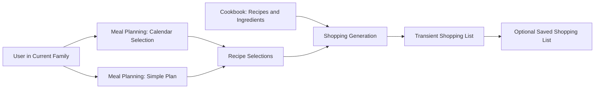

# Architecture and System Boundaries

## Current request flow

The application is a Laravel 13 server-driven single-page application using Inertia 3 and Vue 3. Laravel owns routing, authentication, validation, persistence, and Inertia responses. Vue pages and shared components render the browser interface, while Vite builds the client assets. Wayfinder generates typed frontend bindings for Laravel routes.

The current repository contains Family Access inside `app/FamilyAccess`, Cookbook workflows inside `app/Cookbook`, Meal Planning inside `app/MealPlanning`, and a persistence-independent generator plus snapshot application layer inside `app/ShoppingGeneration`. Family Access owns Families, roleless memberships, Current Family selection, and reusable scoping. Cookbook owns Store and reusable Section lifecycles and ordering, packaged Ingredients and private media, Recipe aggregates, Tags, search, archive/restore, and nutrition. Meal Planning owns Calendar Entries, Calendar projections, transient Simple Plans, session-backed generation state, and adapters into Shopping Generation. Shopping Generation owns pure exact calculation and grouping, typed output, and immutable Saved Shopping List snapshots without depending on Meal Planning persistence.

Current architectural evidence:

- [Laravel bootstrap](../../bootstrap/app.php) registers web routes, middleware, JSON exception behavior, and the `/up` health route.
- [Web routes](../../routes/web.php) redirect the guest root to login and the authenticated root to the placeholder Dashboard; the attached `verified` middleware is currently inert as explained in [Security and observability](security-observability.md#implemented-authentication-controls).
- [Settings routes](../../routes/settings.php) expose authenticated profile, security, password, and appearance operations.
- [Family Access routes](../../routes/family-access.php) expose authenticated Family creation.
- [Cookbook routes](../../routes/cookbook.php) expose Current-Family-scoped Store and Store Section management, Ingredient and direct Alternative management, Recipe aggregate and Tag management, and protected media upload/read routes.
- [Meal Planning routes](../../routes/meal-planning.php) expose Simple Plan, Calendar, generated-result Alternative, snapshot save, and read-only history workflows.
- [Family creation action](../../app/FamilyAccess/Actions/CreateFamily.php) and its sibling module files contain the models, application actions, controller, and request validation.
- [Frontend entry point](../../resources/js/app.ts) resolves Inertia pages and initializes Vue.
- [Composer dependencies](../../composer.json) and [frontend dependencies](../../package.json) define the framework stack.

## Modular monolith direction

The physical modules are established under `app/FamilyAccess`, `app/Cookbook`, `app/MealPlanning`, and `app/ShoppingGeneration`. Family Access owns Family persistence and application behavior without moving the existing `User` identity or authentication into the module. Its reusable `CurrentFamilyScope` resolves membership-validated context and applies that context through a Family-owned model's `family` relationship. Cookbook, Meal Planning, and the saved-history application layer depend on this interface; Family Access does not depend on them. The generator facade and its value objects remain free of HTTP, Eloquent, Calendar persistence, and session concerns.

The implemented ownership split is:

- **Family Access** owns Family, Family Membership, Current Family selection,
  and authorization context.
- **Cookbook** owns Recipe, Ingredient, Recipe Tag, Store, Store Section,
  nutrition, media, and package conversions.
- **Meal Planning** owns Calendar Entry, derived Calendar Day, Calendar
  Selection, and temporary Simple Plan input.
- **Shopping Generation** owns Recipe Selection input, aggregation,
  alternatives, Shopping List output, and Saved Shopping List snapshots while
  remaining independent of Meal Planning persistence.

The dependency direction protects the central calculation boundary. Meal Planning translates selected Calendar Entries into Recipe Selections. A Simple Plan creates the same input directly. Shopping Generation does not query dates, calendar tables, controllers, or UI state; [ADR 0002](../adr/0002-keep-shopping-list-generation-persistence-independent.md) records this trade-off.

<!-- diagram-alt: A User selects one Current Family. Calendar planning and Simple Plan each produce Recipe Selections, which enter the persistence-independent Shopping Generation module. The generator reads Cookbook recipe and ingredient definitions and emits a transient Shopping List that may be saved as a snapshot. -->

The same Family boundary applies at every module edge. Identifiers from different Families are rejected, and cross-Family generation or copying is outside the MVP.

> **Planned**
>
> Agent Integration is the remaining module. It owns Agent Credentials,
> Catalog projections, Change Sets, preview/apply coordination, API resources,
> and the OpenAPI boundary. It will depend on Family Access and invoke Cookbook
> and Meal Planning actions; those modules must not depend on it.

## Application-layer responsibilities

The implemented Family-creation path keeps HTTP validation in a Form Request and delegates the transactional creation of the Family and its first membership to an application action. Account deletion delegates the no-orphan check and deletion transaction to a Family Access action. This establishes the controller-to-action seam without introducing a repository abstraction before one is needed.

Store rename follows the same explicit seam. `PATCH stores/{store}` enters `StoreUpdateRequest`, which normalizes and validates the proposed name without accepting a Family identifier. `StoreController::update` passes the authenticated User, Store identifier, and name to `RenameStore`. The action resolves the Store through `CurrentFamilyScope`, assigns the name so the Store model derives its normalized key, converts a database uniqueness collision to a field validation error, and saves. The controller then redirects to the Stores index with the internal `Store renamed.` translation key, rendered to the User as **Obchod byl přejmenován.** Cookbook depends on Family Access for this ownership boundary; Family Access does not depend on Cookbook.

Store deletion reuses that dependency direction without widening its input. `DeleteStore` resolves and locks the Store inside `CurrentFamilyScope`, clears both placement fields on affected Ingredients, removes entity media with rollback support, and then hard-deletes the Store; associations cascade. Another Family's identifier is not found.

Store Section creation follows the same boundary. `POST store-sections` enters `StoreSectionStoreRequest`, which normalizes the display name and validates a required six-digit hexadecimal colour without accepting a Family identifier. `StoreSectionController::store` passes the authenticated User, name, and colour to `CreateStoreSection`. The action derives ownership exclusively through `CurrentFamilyScope`, persists the ADR 0007 normalized key, and converts a uniqueness collision into a Czech `name` field error. The shared Stores index lists only the Current Family's Sections, renders both a colour swatch and hexadecimal text, and permits a separately validated allowlisted icon key.

Store–Section maintenance uses three explicit association actions behind `StoreSectionAssociationController`. Attach and removal requests pass only the authenticated User and route identifiers; reorder additionally passes the complete Section identifier sequence and the Store order version the User saw. Every action resolves both Store and Store Section records through `CurrentFamilyScope`. Mutations lock the Store, keep positions contiguous, and increment `section_order_version`; reorder rejects a stale version and any sequence that is incomplete, duplicated, or foreign to that Store. Removal deletes only the association and retains the reusable Store Section entity. The application layer remains in Cookbook and depends on Family Access, preserving the modular direction.

Reusable Section deletion locks the Section and affected Stores, clears its identifier from affected Ingredient placements while retaining each Store, removes associations, rewrites positions, advances versions, and deletes the Section in one transaction. The AlertDialog reports current association and placement counts.

Ingredient writes normalize explicit metric input through value objects, resolve placement records only inside Current Family, synchronize an optional complete Nutrition Profile, and convert name races into Czech field errors. Archive/restore and Alternative actions use the same scope. Alternative edges are persisted once by ordered pair, while canonical-kind eligibility is a pure value-level predicate kept independent of HTTP and persistence.

Recipe creation and update submit complete versioned aggregates to Cookbook actions. The write boundary validates same-Family children, quantity-kind dependencies, contiguous order, required Ingredients, optional complete nutrition overrides, and Tag assignments before one transaction replaces the aggregate. Stale versions and any invalid child leave the previous Recipe untouched. Focused query/projector boundaries own Current-Family list/search presentation and nutrition calculation.

Meal Planning actions persist and project only Calendar Entries. Transient Simple Plans and generated presentations are scoped in the session by Current Family. Both adapters load complete Current-Family Recipe and Ingredient facts and build the same immutable `GenerationRequest`; the pure `ShoppingListGenerator` performs exact calculation, Alternative application, re-aggregation, and grouping without persistence access. Saving is a separate action that freezes the successful presentation and source provenance in an explicit versioned snapshot payload.

Controllers and Inertia pages orchestrate use cases rather than perform domain calculations. Application actions load and authorize Family-owned records, translate them into typed domain input, invoke a domain service, and persist only explicit outputs such as Saved Shopping List snapshots.

Framework-specific concerns stay at the boundary:

- HTTP requests and Current Family scope validate interactive authorization.
- Eloquent query services load aggregates and projections.
- Domain value objects represent serving counts, quantities, package
  equivalents, and nutrition using decimal-safe arithmetic.
- Shopping Generation returns a result object and does not write the database.
- Inertia receives presentation-ready resources; Vue does not reproduce package
  or nutrition calculations.

> **Planned**
>
> Family Access will expose an immutable Authorized Family Context for both the
> Current Family and Agent Credential adapters. Agent Integration will expose a
> small Catalog, preview, apply, and history interface while hiding parsing,
> dependency resolution, idempotency, warnings, staleness, transactionality,
> and persistence. [ADR 0035](../adr/0035-pass-an-authorized-family-context-to-domain-actions.md)
> and [ADR 0036](../adr/0036-use-a-deep-agent-integration-module.md) record these seams.

## Frontend boundary

The Vue/Inertia frontend composes Tailwind and shadcn-vue primitives with generated Wayfinder actions. Store controls include colour and icon pickers, ordered association actions, management dialogs, and private image upload. Ingredient and Recipe controls include complete aggregate dialogs, explicit metric units, placement, nutrition, direct Alternatives, archive/restore, status filters, search, and protected images. Calendar, Simple Plan, generated Shopping List, Alternative, Calculation Problem, save-history, pagination, detail, and deletion flows use the same boundary. Generated Wayfinder modules remain ignored/generated and must not be hand-edited.

The implemented layouts keep one responsive Inertia application. Management uses dialogs and responsive card/list layouts, while Calendar and generated Shopping Lists remain operable on narrow viewports. Focused Vitest contracts and recorded browser runs cover the composed navigation, dialog focus, generation, and saved-history paths; package arithmetic remains backend-owned.

## Source boundaries

Do not duplicate canonical definitions in implementation comments or this guide. Update the repository source `CONTEXT.md` when domain language changes and add an ADR only for a hard-to-reverse, surprising trade-off with genuine alternatives. Update this guide after the underlying implementation or approved intent changes.
