# Shopping List generation

## Current status

Shopping Generation is implemented as a pure persistence-independent domain boundary, with Current-Family adapters for Simple Plan and Calendar and a separate application layer for explicit immutable snapshots. [ADR 0001](../adr/0001-use-concrete-purchasable-ingredients.md), [ADR 0002](../adr/0002-keep-shopping-list-generation-persistence-independent.md), and [ADR 0017](../adr/0017-return-an-all-or-nothing-typed-generation-result.md) define its core contracts.

## Service boundary

`ShoppingListGenerator` accepts already resolved Recipe Selections and package facts, composes an exact calculator with a pure grouping collaborator, and returns an all-or-nothing typed result containing either a complete grouped Shopping List or every recoverable Calculation Problem. It does not query Eloquent, know whether selections came from Calendar or Simple Plan, write history, inspect pantry stock, or calculate prices.

The application layer authorizes Current Family, loads only records from that Family, applies source-specific archive rules, and creates an immutable `GenerationRequest`. Meal Planning depends on the generator contract; the generator does not depend on Calendar persistence or session state. [ADR 0018](../adr/0018-compose-grouping-inside-shopping-generation.md) records the grouping seam.

## Input contract

Each invocation receives one or more Recipe Selections. A selection contains stable Recipe identity and name, positive requested Serving Count, positive base Serving Count, and one or more Recipe Ingredient inputs. Every line contains Ingredient identity and name, positive quantity in canonical grams, millilitres, or piece count, current package quantities, optional Store/Section placement, and direct active Alternative definitions. Repeated Recipe Ingredient lines are valid.

The request contains sufficient immutable data for calculation, grouping, correction links, display, and provenance without persistence access. Calendar and Simple Plan adapters produce this same contract.

## Calculation pipeline

Validated `DECIMAL(20,6)` values enter `ExactQuantity`, which uses exact rational arithmetic for serving ratios, package fractions, aggregation, ceiling, and surplus. Each Recipe Ingredient scales by `requested servings / base servings` and divides by its matching canonical package quantity. The generator never parses metric input units or assumes density.

Package fractions from every occurrence of the same final Ingredient are summed before rounding. Purchase Quantity is the ceiling of that global fraction. For each configured package unit, the line derives exact required, purchased, and surplus values. Thus two Recipes requiring `70 g` each from a `150 g` package produce `140 g required → buy 1 package`, rather than two separately rounded packages.

```mermaid
flowchart LR
    Calendar["Calendar Selection"] --> CalendarAdapter["Calendar adapter"]
    Simple["Simple Plan"] --> SimpleAdapter["Simple Plan adapter"]
    CalendarAdapter --> Request["Immutable Generation Request"]
    SimpleAdapter --> Request
    Request --> Scale["Scale exact quantities"]
    Scale --> Alternatives["Apply selected direct Alternatives"]
    Alternatives --> Aggregate["Aggregate by final Ingredient"]
    Aggregate --> Round["Ceiling package count once"]
    Round --> Group["Pure Store and Section grouping"]
    Group --> Result["Complete transient result"]
    Result -->|"explicit save"| Snapshot["Immutable versioned snapshot"]
```

<!-- diagram-alt: Calendar Selection and transient Simple Plan are authorized by separate adapters, then feed the same pure generator, which scales Recipe quantities, aggregates package fractions by final Ingredient, rounds once, groups the complete result, and may pass an explicit successful result to immutable snapshot storage. -->

## Output and grouping

Each final Shopping List Line exposes the whole package Purchase Quantity as its primary instruction. It also contains exact and frozen display values for required, purchased, and Surplus quantities in every configured kind, final placement, and a deterministic contribution breakdown by source Recipe.

`ShoppingListGrouper` orders Store groups by normalized UTF-8 byte key plus stable identity, then follows each Store's persisted Section traversal. Unsectioned lines follow configured Sections, and unplaced lines follow all Stores. Ingredients within a group use the same normalized-name and stable-identity comparator. Tests prove identical output across input order and accent-distinct names without relying on database or platform collation.

## Alternative Ingredients

Initial generation uses the Recipe's concrete Ingredients. A member may select one directly linked active Alternative for an original Ingredient only when its package defines every canonical quantity kind used by that original contribution. There is no cross-kind conversion or manual quantity fallback.

The generator recalculates the selected contribution against the Alternative package, globally re-aggregates all lines that resolve to the same final Ingredient before ceiling, adopts the Alternative placement, and preserves each original choice and Recipe contribution separately. A substituted or merged line cannot be substituted again. Session adapters allow each original choice to be changed or reverted without modifying source Recipes. Stale or invalid choices become Czech field errors or are explicitly reset before retry. [ADR 0016](../adr/0016-require-canonical-quantity-kinds-for-alternative-replacement.md) and [ADR 0021](../adr/0021-keep-alternative-replacement-single-hop.md) record these rules.

## Calculation Problems and recovery

Recoverable invalid input produces no Shopping List Lines. The typed result collects every problem and identifies its stable occurrence, Recipe, Ingredient, quantity, unit, reason, and exact correction destination. Problems cover non-positive or over-scale values, a missing package kind, and an unusable package definition. Empty requests or Recipes without Ingredients are internal contract violations rather than partial results.

The Calendar and Simple Plan presentations show every problem with Czech correction copy, preserve the source selection, invalidate any older successful result, and require explicit retry. Correction links include archived records when necessary and accurately direct the member to restore rather than edit them. Exceptions remain reserved for programming errors and violated internal invariants.

## Presentation precision

Exact values remain lossless in the domain and snapshot payload. Presentation derives grams below 1000 and kilograms from 1000, millilitres below 1000 and litres from 1000, and Czech `ks` for the internal `piece` kind. Secondary quantities use at most two fractional digits with half-up rounding, stripped trailing zeroes, and an approximation marker whenever display differs from the exact value. Purchase package counts remain exact whole numbers.

## Transience and Saved Snapshots

Generation is transient by default. A complete result is stored in Current-Family-namespaced session state for refresh-safe presentation; no Simple Plan or Shopping List row is created. An explicit save action creates a new immutable Saved Shopping List for every accepted request, including identical content and retries. Only successful current results may be saved.

Relational headers store Family, microsecond generation timestamp, source kind, and payload schema version. `SavedShoppingListV1` owns an explicit validated schema that freezes source provenance, grouping, names, package definitions, alternatives, contributions, lossless exact quantities, localized labels, and display values. Later live-record edits, archival, or deletion cannot change the read-only detail. The reader dispatches by schema version and presents an intentional Czech unavailable state for unsupported or corrupt payloads instead of passing malformed data to Vue. [ADR 0020](../adr/0020-store-versioned-shopping-list-snapshot-payloads.md) and [ADR 0025](../adr/0025-create-a-snapshot-for-every-save.md) record this boundary.

History queries are Current-Family scoped, order by generation timestamp and identifier, select only relational summary columns, and use bounded cursor pagination. Detail loads one payload on demand. Any Family member may delete a snapshot; deletion does not alter Recipes, Calendar Entries, or another snapshot and restores keyboard focus to a stable visible heading.

## Verification

Pure PHPUnit tests cover fractional servings, repeated lines, global aggregation before rounding, grams, millilitres and pieces, exact whole-package boundaries, surplus, contributions, every recoverable problem, direct Alternative eligibility/application/revert, deterministic grouping, and internal contract violations without Laravel or a database. Feature tests separately prove both source adapters, two-Family isolation, archive rules, session recovery, Czech feedback, immutable versioned round-trips, unsupported payload handling, bounded history, and equal-member deletion. Focused Vitest and browser evidence cover responsive presentation, corrections, alternatives, save feedback, read-only history, pagination, dialog cancellation/confirmation, focus recovery, and console-clean navigation.
